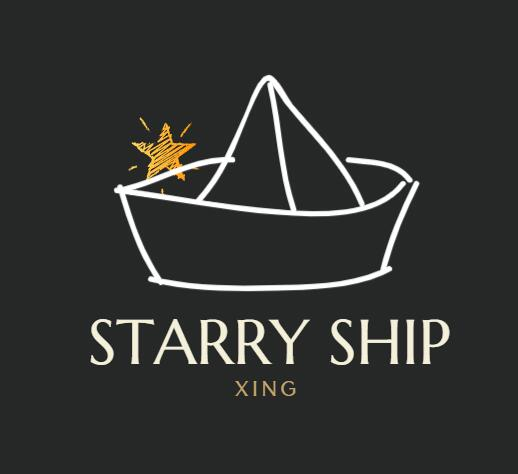

# Hey !👋 Nice to meet you.

<!--
**Starryship/Starryship** is a ✨ _special_ ✨ repository because its `README.md` (this file) appears on your GitHub profile.

Here are some ideas to get you started:

- 🔭 I’m currently working on ...
- 🌱 I’m currently learning ...
- 👯 I’m looking to collaborate on ...
- 🤔 I’m looking for help with ...
- 💬 Ask me about ...
- 📫 How to reach me: ...
- 😄 Pronouns: ...
- ⚡ Fun fact: ...
-->

<!--

Here is the translation of my introduction

你们好！欢迎来到我的github主页。我是福州大学计算机与大数据学院，数据科学与大数据技术专业的一名学生。现在在攻读的领域为AI、大数据和前端。对于AI领域，我善于使用pytorch搭建神经网络与模型调优，涉及到的领域有计算机视觉（2D and 3D）、语音识别、声音克隆等。喜欢研究AI，上手大模型的部署与架构的解析，在研项目有**"SV3D 宠物图像到视频扩散模型进行新的多视图合成和 3D 生成宠物虚拟形象"**和**“基于MindSpore实现LoRA到SV3D单图潜在合成多视角视频”**等。对于自己的专业领域，我擅长数据处理和数据采集，善于使用hadoop等的分布式计算框架。但是对于前端领域，目前只是初步了解html、js和vue，并没有上手做项目，未来打算使用一些前端框架设计web。

对于未来的规划，我想成为一个数据挖掘、数据分析和AI工程师。先把课内的任务做好，再自己去做一些项目、参加一些比赛什么的，然后考虑升学，往一个更好地方向去发展。

-->

<h1 align="center">About me👯</h1>

Hello there! Welcome to my GitHub page. I’m a student at the College of Computer Science and Big Data at Fuzhou University, majoring in Data Science and Big Data Technology. I’m currently diving deep into the fascinating worlds of AI, big data, and front-end development.

When it comes to AI, I’m like a fish in water with PyTorch—I love building neural networks and fine-tuning models. My adventures in AI have taken me through the realms of computer vision (both 2D and 3D), speech recognition, and even sound cloning. I’m all about experimenting with AI, deploying large models, and cracking open the mysteries of their architectures. I’m currently involved in research projects with fun titles like “SV3D: Pet Image-to-Video Diffusion Model for New Multi-View Synthesis and 3D Generated Pet Avatars” and “LoRA to SV3D: Single Image Latent Multi-View Video Synthesis Using MindSpore”. As for my field of study, I excel at data processing and data collection and am pretty handy with distributed computing frameworks like Hadoop. But when it comes to front-end development, well, let's just say I'm still in the “hello world” phase with HTML, JavaScript, and Vue. In the future, I plan to get my hands dirty with some front-end frameworks to design cool web stuff.

Looking ahead, my master plan is to become a data mining, data analysis, and AI engineer. First, I’ll ace my coursework, then I’ll dabble in some projects and competitions, and finally, I’ll consider further studies to reach even greater heights.

<h2 align="left">😄 Myself </h2>

- 🔭 I’m currently a student at **FZU**.
- 📝 I regularly write articles on
  [csdn](https://blog.csdn.net/2301_76181286?spm=1000.2115.3001.5343)、
  [cnblog](https://home.cnblogs.com/u/starryship)
- 📫 How to reach me **xing@west2.online**
、**starryshipxing@gmail.com(recommended)**

- ⚡ Fun fact **A good guy.**

<h2 align="left">✨ Languages and Tools:</h2>

                 

<h2 align="left">🌱 My lovely logo !</h2>

